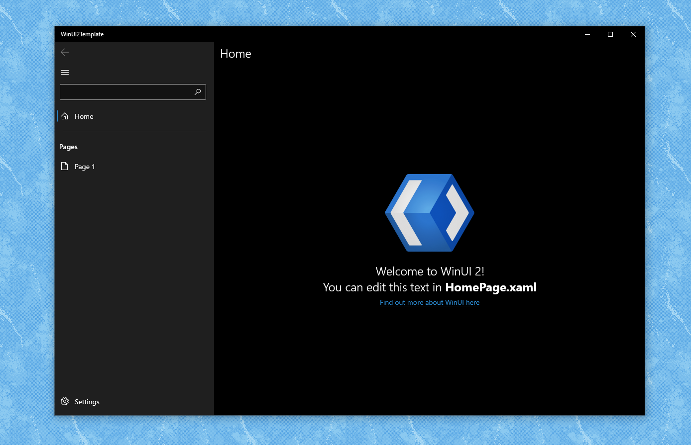

# UWP Fast Track Template
A UWP temlpate that lets you start making high-quality apps quickly.

Available in Visual Studio Marketplace: https://marketplace.visualstudio.com/items?itemName=ColinKiama.winui-2-template

You can also select "Use this template" and rename namespaces and files yourself.

## Overview
2 Projects:
- .Net Standard library
- UWP app with a NavigationView

### Features:
- Localisation preconfigured. 
- Multilingual App Toolkit enabled
- Basic MVVM Navigation setup
- Dependency Injection configured
- Includes Windows Community Toolkit and WinUI 2 package

## Initial Setup
1. In the UWP project, add a reference to the .Net Standard library project
2. Set the UWP Project as the default startup project
3. Change the build architecture type to a specific one

## Template Structure
This template is a UWP app with WinUI 2.4 installed and ready to use.

- MainView(Where a NavigationView for the whole app exists)
- HomeView(The first view displayed in the navigation view)
- Page1 (A secondary view that used to show how you can navigate between pages)
- SettingsView(Shows when you select the settings item on the NavigationView)

## Branches
| Branch Name | Description |
|-------------|----------- |
| master | Changes from the `runnable` branch used in the latest production release. |
| runnable | A runnable version of the template that will be exported in the `dev` branch. |
| dev | Takes the changes from the `runnable` branch and replaces the names with template parameters.|

## Making your own templates
Learn how to make your own templates here (It can save you a lot of time!): https://docs.microsoft.com/en-us/visualstudio/extensibility/creating-custom-project-and-item-templates?view=vs-2019
